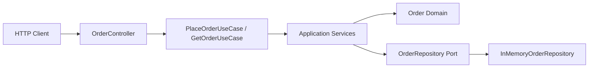

# C1.1-P01 Runtime View

## Important interpretation

The arrows show runtime dependency/call direction for the current baseline. They do not declare bounded contexts, microservices, team ownership, or final deployment boundaries.

The domain has no Spring dependency.

The HTTP adapter translates transport concerns into application commands.

The in-memory adapter provides temporary runtime state only.
