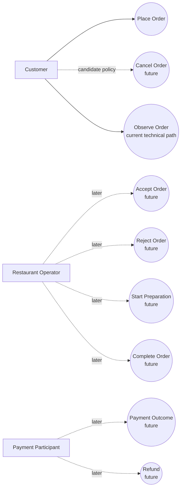

# C1.1-P02 — Actor and Use-Case Map

## Reading rule

Solid lines represent the current executable/observation slice.

Dashed lines represent discovered or candidate responsibilities required by the roadmap-level workflow but **not implemented in P02**.

The diagram is not a service diagram, deployment diagram, bounded-context map, or database-ownership model.
